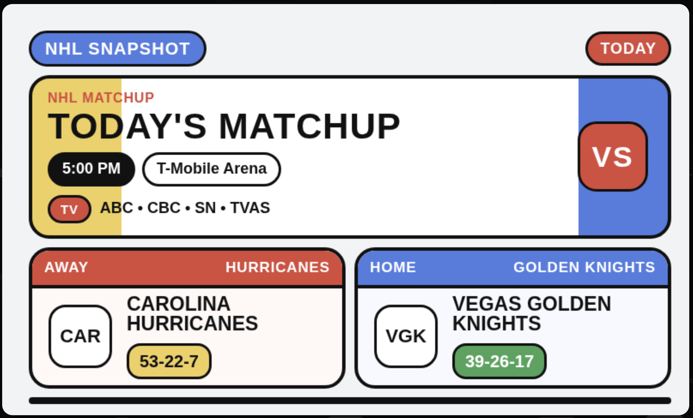
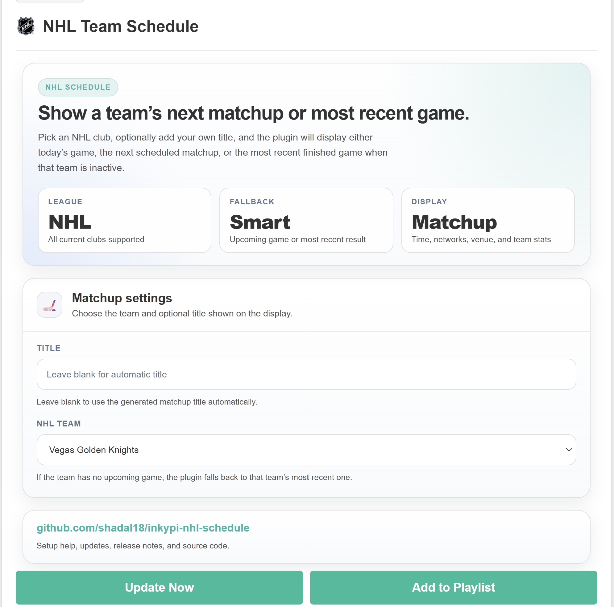

# InkyPi NHL Team Schedule

A plugin that shows an NHL team’s next matchup or most recent game on an InkyPi display with a clean, glanceable layout and configurable team selection.

_NHL Team Schedule_ is a plugin for [InkyPi](https://github.com/fatihak/InkyPi) that displays a selected NHL club’s upcoming game, or falls back to the most recent game when no upcoming matchup is available.

## Install

Use the InkyPi plugin installer with the plugin ID and this repository URL, following the install pattern shown by the official InkyPi plugin documentation.

```bash
inkypi plugin install nhl_team_schedule https://github.com/shadal18/inkypi-nhl-schedule
```

## Update

To update the plugin on your InkyPi device:

1. SSH into your InkyPi host.
2. Change into the plugin directory:
   ```bash
   cd ~/InkyPi/src/plugins/nhl_team_schedule
   ```
3. Run this update command:
   ```bash
   git pull origin main && \
   if [ -d nhl_team_schedule ]; then \
     rsync -a nhl_team_schedule/ ./ && \
     rm -rf nhl_team_schedule; \
   fi && \
   sudo systemctl restart inkypi.service
   ```

If you don’t see your changes after updating:

- Confirm you are in the correct plugin folder.
- Clear your browser cache or hard refresh the InkyPi web UI.
- Check the InkyPi logs for any plugin errors.
- Restart the InkyPi service manually if needed:
  ```bash
  sudo systemctl restart inkypi.service
  ```

## Requirements

- Network access from the InkyPi device to the public NHL API endpoints used by the plugin.
- An active internet connection so the plugin can retrieve schedule and standings data.

## Features

This plugin is an extension for the InkyPi e-paper display frame and includes the following features.

- Shows the selected NHL team’s next scheduled game.
- Falls back to the most recent game when no upcoming game is available.
- Displays matchup time and day.
- Displays venue information.
- Displays broadcast network information when available.
- Displays both teams in the matchup.
- Displays team logos when logo assets are available.
- Displays season stats including wins, losses, overtime losses, goals for, goals against, power play percentage, and penalty kill percentage.
- Supports an optional custom title from the settings page.
- Clean layout optimized for quick glance reading on e-paper.

## Settings

The plugin settings page lets you customize:

- Title.
- NHL team.

## Repository

GitHub repository:

[https://github.com/shadal18/inkypi-nhl-schedule](https://github.com/shadal18/inkypi-nhl-schedule)

## Screenshots

- NHL Team Schedule plugin.
- Settings.

<p align="center">
  
  
</p>
